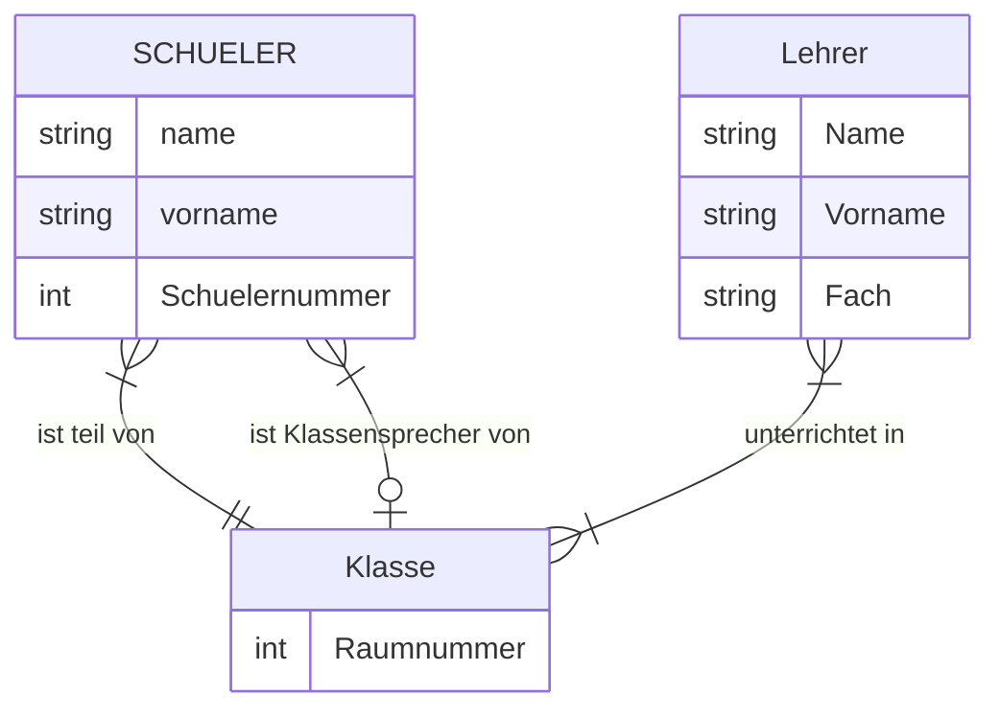
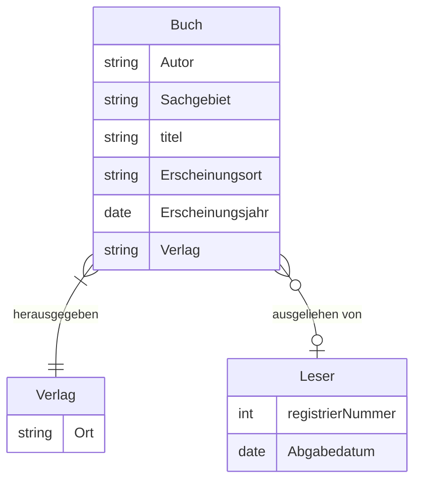

Datenbanken werden benutzt um Informationen zu Speichern, Verwalten und Manipulieren.
Die Software, welche die Datenbank verwaltet, wird *Database Management System (DBMS)* genannt. Mit diesem kann man nach Daten Suchen, sowie Sortieren, Filtern und formatiert Ausgeben.

Die Daten in einer Datenbank sind eine strukturierte Ansammlung von Informationen und lassen sich nach bestimmten Kriterien unterscheiden:
- *Stammdaten*:
  unveränderliche oder selten veränderte Information, die dauerhaft Auskunft über Objekte oder Sachverhalte geben; z.B. Name einer Person oder Bestellnummer eines Artikels.
- *Bewegungsdaten*:
  Informationen die sich ständig ändern (und Abläufe oder Prozesse abbilden); z.B. Saldo auf einem Konto, Körpertemperatur eines Patienten
- *Rechendaten*:
  Daten die Teil einer Berechnung sind oder als Basis für eine dienen; z.B. Preise, Zinssätze
- *Ordnungsdaten*:
  Daten die der Einteilung, Klassifizierung und Filterung von Informationen dienen; z.B. Name, Postleitzahl, Kfz-Kennzeichen

Jedes einzelne Datum in einer Datenbank weist zwei dieser Kriterien auf, wodurch sich folgende Kombinationen bilden können:
- **Stamm- und Rechendatum**: z.B. Preis einer Ware, Grundgehalt eines Arbeiters, Jahreszins eines Kredits
- **Stamm- und Ordnungsdaten**: z.B. Name einer Person, Bestellnummer eines Artikels, Titel eines Buchs
- **Bewegungs- und Rechendatum**: z.B. Anzahl von Überstunden, Anzahl von gefahrenen Kilometern, Wechselkurs einer Währung
- **Bewegungs- und Ordnungsdatum**: z.B. aktuelles Kalenderdatum, Anzahl von Urlaubstagen, Stückzahl eines Artikels in einem Lager
# Datenbanktypen
- **Einzeltabellendatenbanken**:
  dienen der einfachen Verwaltung von Daten eines bestimmten Types, für die professionelle IT irrelevant
- **Relationale Datenbanken**:
  Verwenden Tabellen zur Datenspeicherung, diese können miteinander verknüpft werden um Daten konsistent zu halten und Informationen die an verschiedenen Stellen vorkommen müssen nur einmal angelegt werden.
- **Objektorientierte Datenbank**:
  arbeiten auf der Grundlage von Klassen und Objekten, anders als relationale Datenbanken sind sie in der Lage komplexe nicht-lineare Beziehungen zwischen Informationen abzubilden
- **Graphendatenbanken**:
  speichern Datensätze als Knoten und Verknüpfungen als Kanten eines Graphen und ermöglichen so die Abbildung vielfältiger Beziehungen zwischen Daten
>[!note]
>Diese eignen sich sehr gut für [[Abominable Intelligence - Silica Animus#Datenanalyse|Datenanalyse]],Vektorsuche oder die Modellierung von Netzwerken und Hierarchien. 
>[Neo4j](https://neo4j.com/) ist ein Open-Source Tool dafür.
- **Volltextdatenbanken**:
  Kein gesonderter Datenbanktyp, sondern eine Implementierung von effektiven Volltextsuchen 
- **XML-Datenbanken**:
  Speichern Daten in Form von [[(XML) eXtensible Markup Language|XML-Dokumenten]] ab
- **NoSQL-Datenbanken**:
  Speichern Daten als Dokumente mit beliebig definierbaren Metadatenfeldern ab

Zusätzlich gibt es noch verschiedene Managementsysteme:
- **Digital-Asset-Management System (DAM)**:
  meist erweiterte relationale Datenbanken, die die Verwaltung von Bildern, Sounddateien und Videodateien ermöglichen
- **Media-Asset Management System (MAM)**:
  werden für TV, Streaming und Videos verwendet und erlauben die Verwaltung von vorgegebenen und frei definierbaren Metadaten, sowie die Eingabe von Video- und Audiodaten über verschiedene Kanäle, *Ingest*, und die Formatumwandlung, *Transcoding*. Zusätzlich können die Dateien als Stream und Radio. oder TV Ausstrahlung ausgegeben werden. 
# Datenbankentwurf

## ER-Modell
Um die unübersichtlichen Datenmengen die in einer Datenbank verarbeitet werden kontrollieren zu können wird das *Entity-Relationship-Modell (ER-Modell)*.
>[!info]
>Das *Entity* steht für einzelne Tabellen, in welcher Daten zugeordnet werden.
>*Relationship* für die inhaltlichen Beziehungen die zwischen Tabellen bestehen.

>[!example] Fallbeispiel
>In diesem Abschnitt werden wir das folgende Fallbeispiel modellieren:
>
>Die Schülerin Lena Ängstlich wechselt neu an die Schule und erhält als Schülernummer die Zahl 1501. Sie wird zu ihren Freunden, Jonas Starkimarm und Hannah Bleibtreu, der Klasse 10a zugeteilt. Der Klassenlehrer Herr R. Tragbar begrüßt sie zusammen mit der Klassensprecherin Sophie Goldzunge am ersten Tag in der Schule und führt sie ins Klassenzimmer.

Das Vorgehen beim Datenbankentwurf gliedert sich grob in:
1. Auflisten der Entitätstypen
2. Auswahl der Attribute
3. Festlegen der Beziehungstypen
4. Definition der Kardinalitäten

## Entitäten und Attribute

> [!info]
> *Entitäten* sind physische oder abstrakte Objekte, die aufgrund ihrer Eigenschaften oder Verhaltensweisen gruppiert werden können.
> 
> *Attribute* sind die Eigenschaften der Entitäten.

>[!warning]
>Attribute müssen *atomar* sein, d.h. einen Einzelwert enthalten und nicht mehrere. Ebenso gehört ein Attribut immer nur zu einer Entität oder Beziehung.

>[!tip]
>Wenn mehrere Entitäten die selben Attribute haben, kann das ein Hinweis auf einen ungünstigen Entwurf sein. 

Um ER-Modelle zu notieren wird die *Chen-Notation* verwendet:
- *Rechteck*: Entitätstypen/ Entitäten
- *Ellipse*: Attribute von Entitäten; werden mit einer Linie zur Entität verbunden
![[ER-Modell Chen notation.png]]

## Beziehungen und Kardinalitäten
- Entitäten stehen mit anderen Entitäten in *Beziehung* zu einander.
- *Kardinalität* gibt die Mengenangabe einer Beziehung an.

Die unterschiedlichen Kardinalitäten sind:
- *1:1*: Jede Entität des einen Entitätstyps steht mit einer Entität des anderen Entitätstyps in Beziehung; gleiches gilt fur die Gegenrichtung. 
  z.B. Eine Klasse hat einen Klassensprecher; ein Klassensprecher gehört nur zu einer Klasse
- *1:n*: Jede Entität des einen Entitätstyps steht mit beliebig vielen Entitäten des anderen Entitätstyps in Beziehung. In der Gegenrichtung steht jede Entität des einen Entitätstyps mit einer Entität des anderen Entitätstyps in Beziehung. 
  z.b. Eine Klasse besteht aus mehreren Schülern; ein Schüler gehört nur zu einer Klasse
- *n:m*: Jede Entität des einen Entitätstyps steht mit beliebig vielen Entitäten des anderen Entitätstyps in Beziehung; gleiches gilt fur die Gegenrichtung.
  z.b. Ein Lehrer unterrichtet n Klassen; eine Klasse wird von m Lehrern unterrichtet

In der *Chen-Notation* werden Beziehungen durch Rauten dargestellt.
![[Beziehung und Kardinalitäten Chen.png]]

## Normalisierung
*Normalisierung* ist der Vorgang mit dem sichergestellt wird, dass jegliche Redundanz in einer Datenbank beseitigt wird.
Hierfür werden 5 *Normalformen* definiert, die aufeinander aufbauen und bei Fertigung eines relationalen Datenbankmodells helfen.
- **erste Normalform (1NF)**:
  Informationen in einem Feld müssen *atomar*, also nicht weiter zerlegbare Einzelinformationen, sein und es dürfen auch keine listenartige Wiederholungen gleichartiger Informationen vorkommen (etwa mehrere Telefonnummern einer Person)
- **zweite Normalform (2NF)**:
  Datensätze dürfen Informationen nur über einen Sachverhalt haben, z.B. eine Person mit zwei Wohnsitzen darf nicht zweimal in einer Tabelle aufgenommen werden, der Wohnsitz müsste in eine eigene Tabelle umgewandelt und der Bezug zur Person über einen Fremdschlüssel hergestellt werden
- **dritte Normalform (3NF)**:
  alle Felder sind funktional unabhängig voneinander

>[!note] Boyce-Codd-Normalform (BCNF)
> Die BCNF ist eine strenger Form von 3NF und schreibt vor, dass eine Tabelle nur einen Primärschlüssel hat. D.h. eine Tabelle die einen zusammengesetzten Primärschlüssel hat, muss in mehrere Tabellen mit einem einzelnen Primärschlüssel umgewandelt werden.

- **vierte Normalform (4NF)**:
  Es dürfen keine Redundanzen durch die mehrfache Nennung von Attributen in verschiedenen Datensätzen vorkommen
- **fünfte Normalform (5NF)**:
  In der Tabelle existieren nur triviale Join-Abhängigkeiten
# Relationale Datenbanken
Relationale Datenbanken verwenden Tabellen zum Speichern von Daten, welche miteinander verknüpft werden können. Durch diese Verknüpfungen ist die Datenbank *konsistent*, d.h. Informationen müssen nur einmal gespeichert werden und können da wo sie gebraucht werden verknüpft werden.

>[!note]
>Datenbanken die nicht den Prinzipien von relationalen Datenbanken folgen werden, *NoSQL* Datenbanken gennant.

Eine Tabelle hat folgende Elemente:
- eindeutiger Name
- *Datenfeld*:
  einzelne Zelle in der Tabelle
- *Attribute*: 
  eine oder mehrere eindeutig benannte Spalten 
- *Datentyp*:
   jedes Attribut hat einen genau definierten Wertebereich 
- *Datensätze* (Records):
   eine beliebige Anzahl an Zeilen, die jeweils eine *Entität* darstellen 
- *Primärschlüssel*: 
  einer oder mehrere Werte, die einen Datensatz eindeutig identifiziert und nur einmal in der Tabelle vorkommen dürfen
- *Fremdschlüssel*: 
  verknüpfter Primärschlüssel einer anderen Tabelle

![[Relationale Datenbank Schema.png]]
## Datentypen
Bei der Erstellung von Tabellen müssen die Datentypen der Attribute festgelegt werden. Die richtige Wahl des Datentypen ermöglicht die effiziente und korrekte Speicherung und Verarbeitung von Daten.
![[Relationale DB Datentypen.png]]

## Relational Database Management System (RDBMS)
Es gibt verschiedene Arten von RDBMS:
- **Desktopdatenbanken**:
  Datenverwaltung mit grafischer Oberfläche für die einfache und übersichtliche Verwaltung
  z.B. Mircosoft Access, OpenOffice Base und FileMaker
- **Kommerzielle Datenbankserver**:
  Komplexe und modulare Systeme, die für den Einsatz von verteilten Unternehmensanwendungen verwendet werden
  z.B. Microsoft SQL Server, Oracle, IBM DB2
- **Freie Datenbankserver**:
  Alternative zu kommerziellen Servern und Open-Source
  z.B. [[MySQL]], PostgreSQL

> [!NOTE]
> [sqlite](https://sqlite.org/) ist ein Open-Source-Projekt, ohne Desktopanwendung und Datenbankserver, das Daten in einfachen Dateien speichert und über eine Schnittstelle für Programmiersprachen direkt von diesen verwaltet werden kann. Es ist eingebettet in vielen Programmen und Geräten zu finden.
# Objektorientierte Datenbanken
Objektorientierte Datenbanken werden bei Datenstrukturen eingesetzt, die sich nur unzureichend mit relationalen Datenbankmodellen darstellen lassen, und als Klassen mit Attributen definiert werden.

> [!NOTE]
> Ein Beispiel für eine Datenstruktur die sich nur schwer mit relationalen Datenbanken darstellen lässt sind die Entfernung von verschiedenen Orten:
> ![[Objektorientierte Datenbank Städte Bsp.png]]

# Dokumentorientierte Datenbanken
Diese Datenbanken speichern Daten als [[(JSON) JavaScript Object Notation|JSON]] oder BSON Dokumente ab.
Die Dokumente sind dabei eine Sammlung frei definierbarer Felder, die aus einem Namen und einem Wert bestehen.
